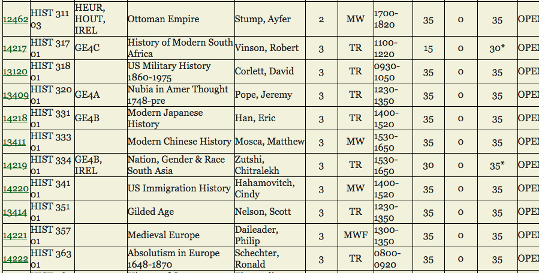
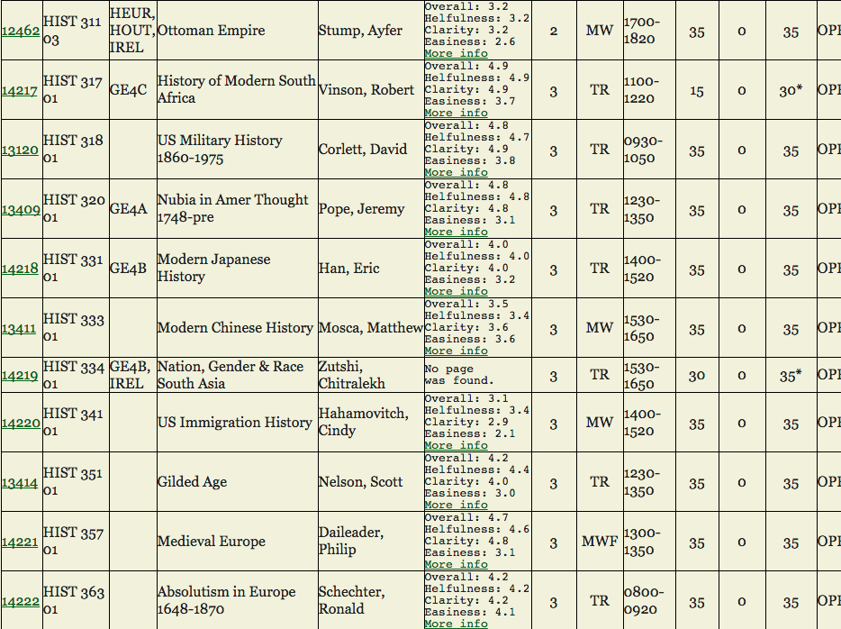

# WMRateMyProfessorChromeExtension

This is a chrome extension that modifies the result pages from [William and Mary's Open Course List](https://courselist.wm.edu/) 
to include the ratings associated with each professor from RateMyProfessor.com. For the professors it finds an query hit for,
the Overall, Helpfulness, Clarity, and Easiness ratings are injected into the course list table, as well as a link to the
professor's complete page so that reviews can be seen as well. 

##Before the Extension

##After the Extension

This project took a few days and I did it to practice my familiarity with HTML, CSS, Javascript and JQuery. The end result 
works as intended, but because Rate My Professor does not have a public API from which I could have gathered this information,
I had get it all by web scraping. This will surely shorten the longetivity of this extension's usefulness, unless I, or 
the other programmers at W&M update it as RMP's and the W&M Open Course List's pages change.
